# **Getting started**

<<<<<<< HEAD
## Installing Docs-Generator
  
 

1. Upload docs-generator content folder on your personal or local server.

 

2. Open your browser, then go to the adresse of docs-generator app : **//home/docs-generator**.

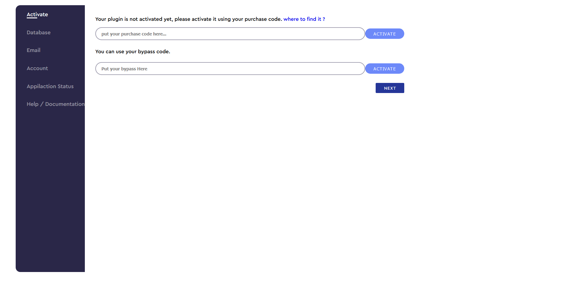

### Activation
3. The first step on install documents generator is the activation.
> You have two options for activation:

    * using your purchase code. [Where find it ? ](https://help.market.envato.com/hc/en-us/articles/202822600-Where-Is-My-Purchase-Code-)
    * Using your bypass code.
    * Click on **Activate** button.
    * Congratulations You’ve successfully **activate** Docs-Generator, enjoy it.

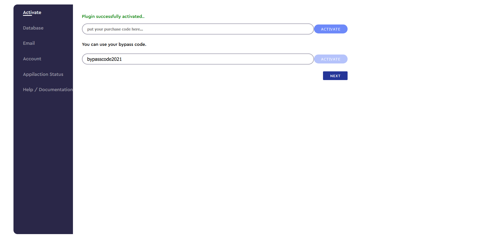

### Database Settings
> The second step is to set the **database settings** :

  * Hostname
  * Username
  * Password
  * Database name.

> If the database don't exist, you can create it manually or by clicking on create button.
Finally click on verify db button, if settings are ok, you will recive a success message, else you need to verify your settings.

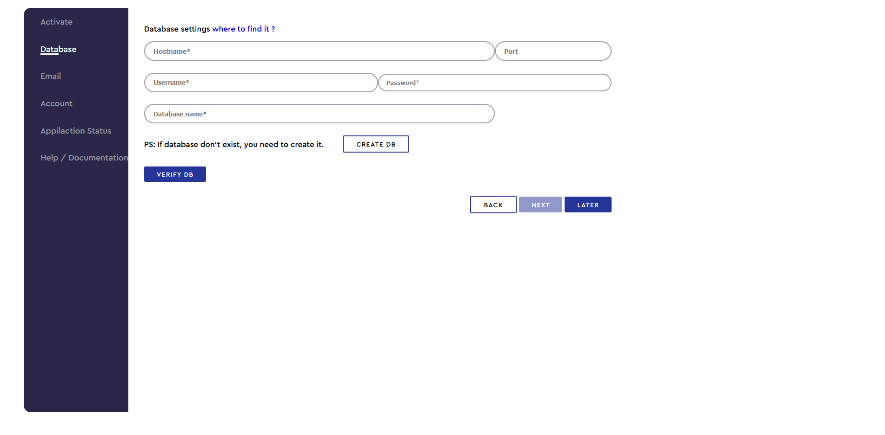

### EMail Settings
> The next step is to setup the mail settings that will be used when you generate documents to send them to your customers.
  You can skip this step or also skip the database settings step and configure them later.
> In this step, we have two options:

  * Default server mail.
  * Custom mail.

> If you select a custom mail, then you need to setup **the SMTP server, port, your mail adresse and  password **.[where to find this settings ? ](https://www.serversmtp.com/smtp-server-address/)

> Then you can check if settings are ok, so put anathor mail adresse then click on send button, you will recive a success or an error message if some of settings are invalide.
> Now check your mail account to see if you received a test mail.

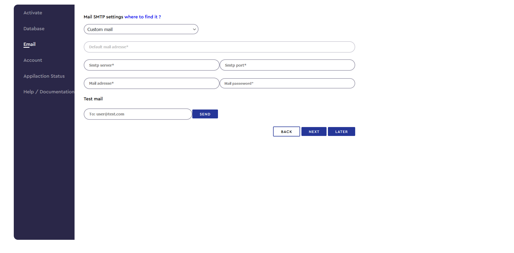

### Account Settings

> Next step is the account settings, you must change the default seetings, and put your email adresse and choose a password for your documents generator account.
> You need to verify carrefully you adresse mail because it will be used to recover your passwor if you forgot it.

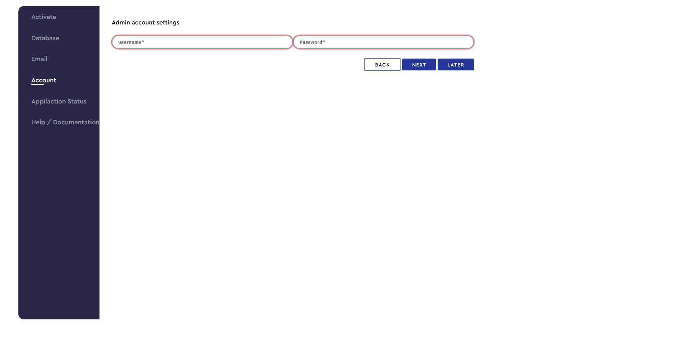

### App status

> Now you can see the previous steps status, and check if there is some errors to resolved them.

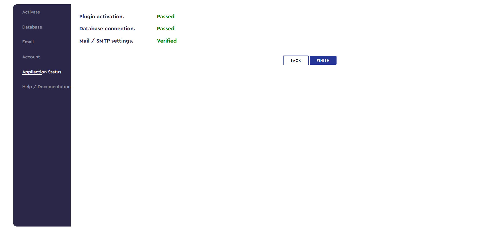

### Delete install folder

> The final step is to delete the install folder, so all you need is to refer to documents generator folder on your server, then delete install folder.

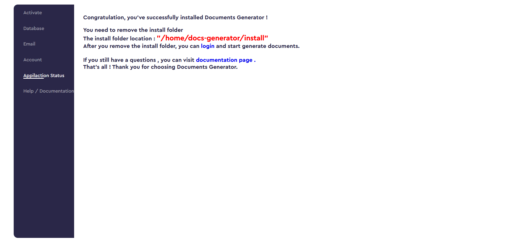

> Now you can click on login link, then put your username and password, and you can start generate your documents

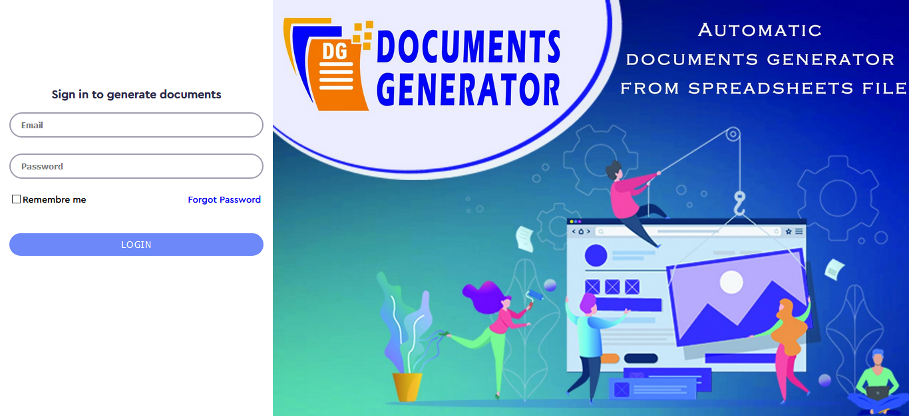
=======
## Installing wordpress plugin

- Here are a few links to help you start your website’s back-end and get your site ready for installing a wordpress plugin :
  1. [How to install wordpress plugin ](https://www.siteground.com/tutorials/wordpress/install-plugins/)
  2. [Wordpress Community](https://wordpress.org/news/category/community/)

## Installing Docs-Generator plugin
  
 

1. Upload docs-generator zip file  via WordPress Dashboard > Plugins > Add New > Upload > Install Now

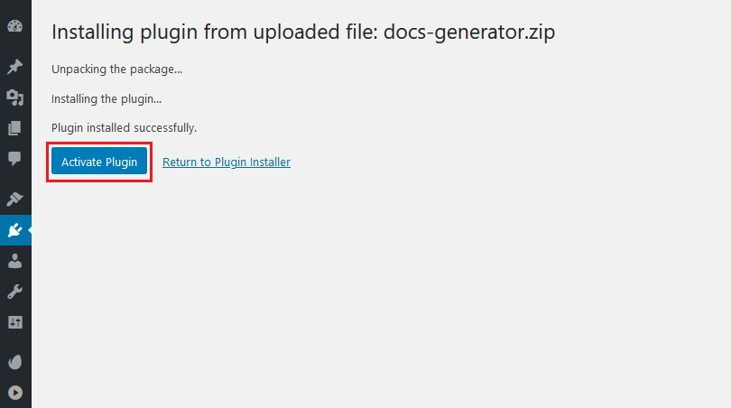
 

3. Click Activate Plugin.
4. Congratulations You’ve successfully installed and activated Docs-Generator plugin on your website.

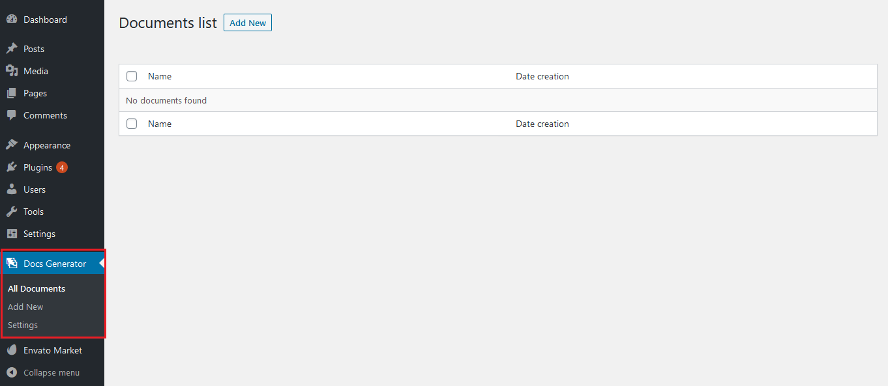

>>>>>>> 998627da253a224b541c5112b9127193239887b8

# **Prepare document**

> In this section , we will see how to add template and data for your document.
Let's start with Add new document.

## Step 1: Add template
> To add a template for your document:

1. Click on **browse** button.
<<<<<<< HEAD
2. Choose an image from your personal folder.
3. **Validate** your choice.
>> **PS:** You can skip the guide by clicking on **Close** or "**dont show again**" button.

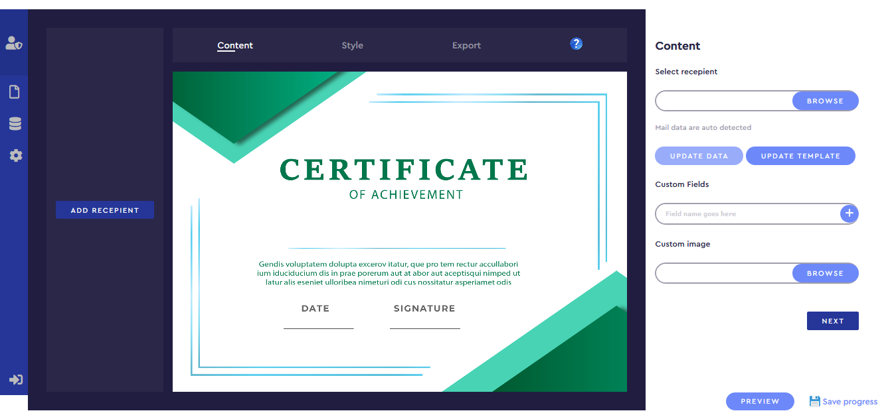
=======

2. Choose an image from your gallery or you can **upload** an new one from you local machine.
3. **Validate** your choice.
>> **PS:** You can skip the guide by clicking on **Close** or "**dont show again**" button.

>>>>>>> 998627da253a224b541c5112b9127193239887b8

## Step 2: Add Data
> The data that will be used in the generated documents are extracted from an Excel file.
The file header will be converted into fields to place it in your template, and when you export your documents, Fields will be replaceted with their data.
To add Data:

1. Click on **browse** / **add recepient** button.

<<<<<<< HEAD
2. Choose an Excel file from your local folder.
3. **Validate** your choice.
=======
2. Choose an Excel file from your gallery or you can **upload** an new one from you local machine.
3. **Validate** your choice.

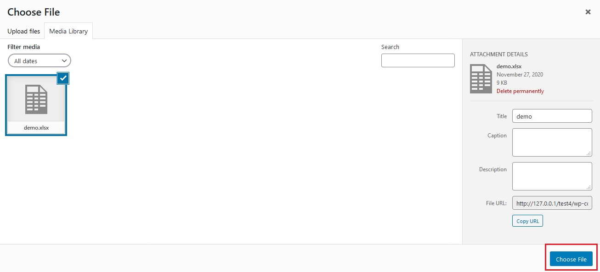

>>>>>>> 998627da253a224b541c5112b9127193239887b8
4. Select the Fields to use in your document.
5. If you have in your Excel file an **image** data ***( Url of an image )***, you can definet it.
6. Click on validate.

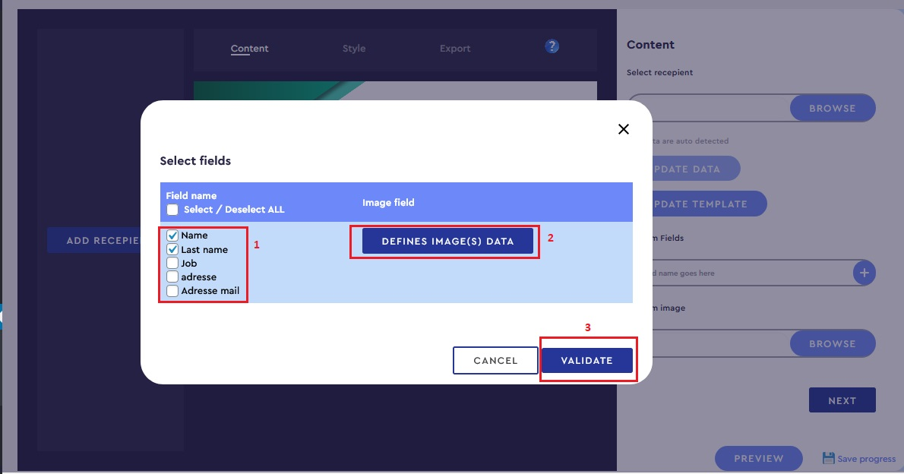

# **Document Customization**

## Content

> In this section , we will see how to customize the content of your document.

### _Fields_

> Let's start with placing our fields in their appropriate places with just simple drag.

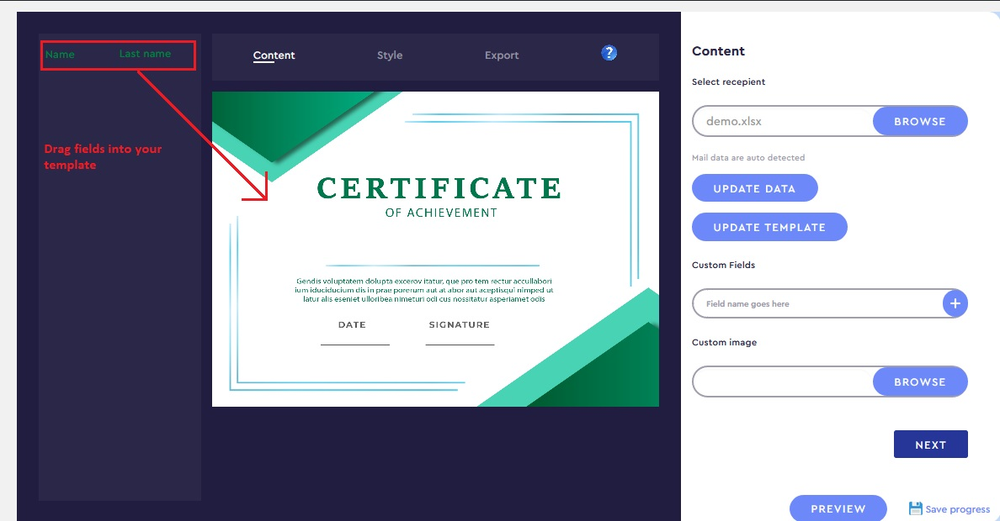

### _Custom Fields_

> To add a custom field who will be the same for all generated documents:
  1. Type the text of custom field
  2. Click on add button.

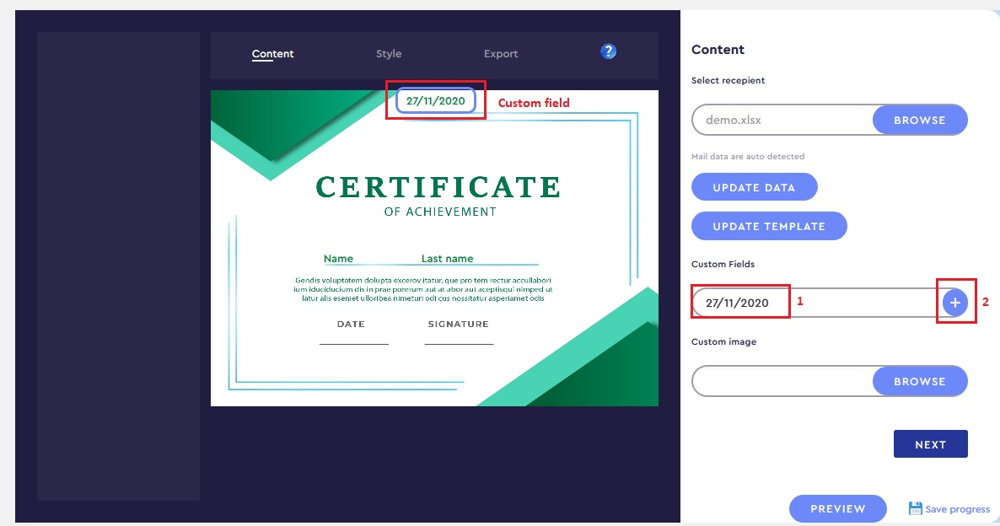

### _Custom Image_

> To add a **custom Image** who will be the same for all generated documents: 
  1. Click on browse button.

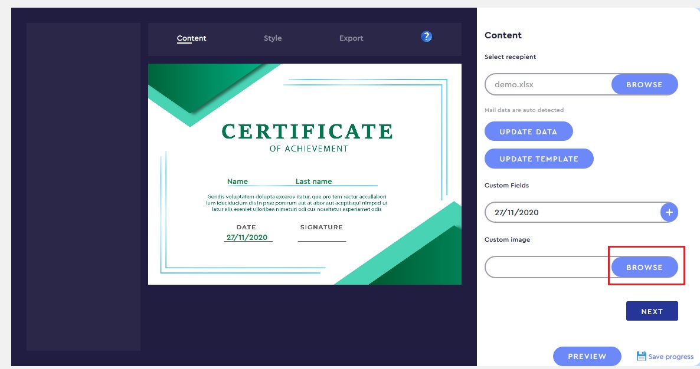

<<<<<<< HEAD
  2. Choose an image from your local folders.
=======
  2. Choose an image from your gallery or upload a new one.
>>>>>>> 998627da253a224b541c5112b9127193239887b8
  3. Validate your choice. 

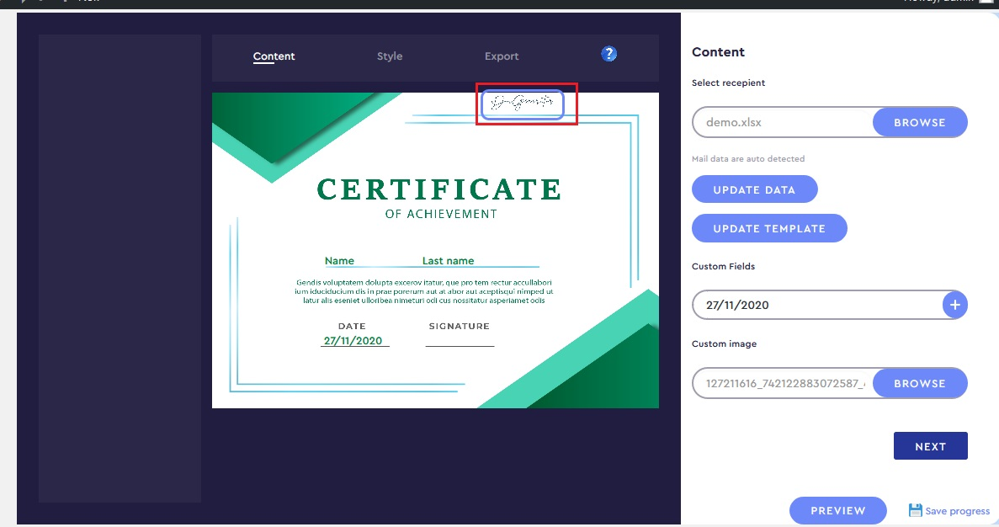
 

### _Update Template_

> You can change and update your template at any time, just click on **Update template** button.

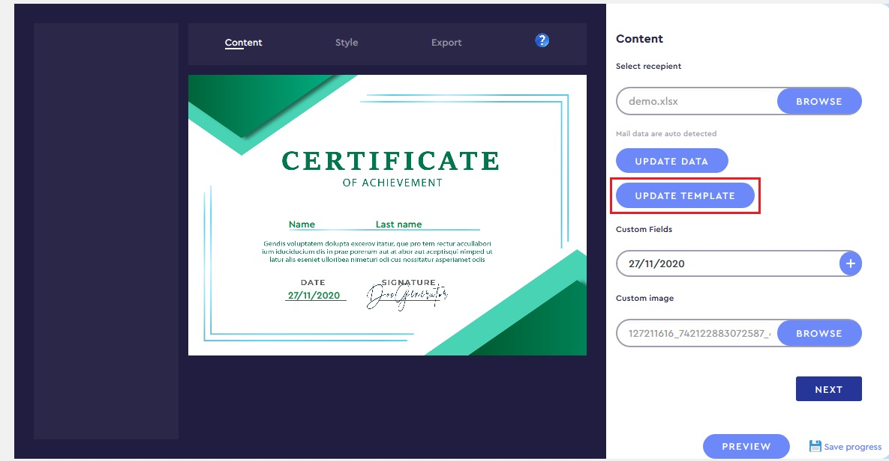

### _Update Data_

> You have 2 options for updating your data:
1. Change the whole Data by clicking on **browse** button, fields will reset their positions.

2. Update data and **keep field** and their position by clicking on **update data** button

# **Document Styles**

> In this section , we will see how to change fields and image style.

## Fields Style

> First off all, you need to move to style panel by clicking on style menu or next button.

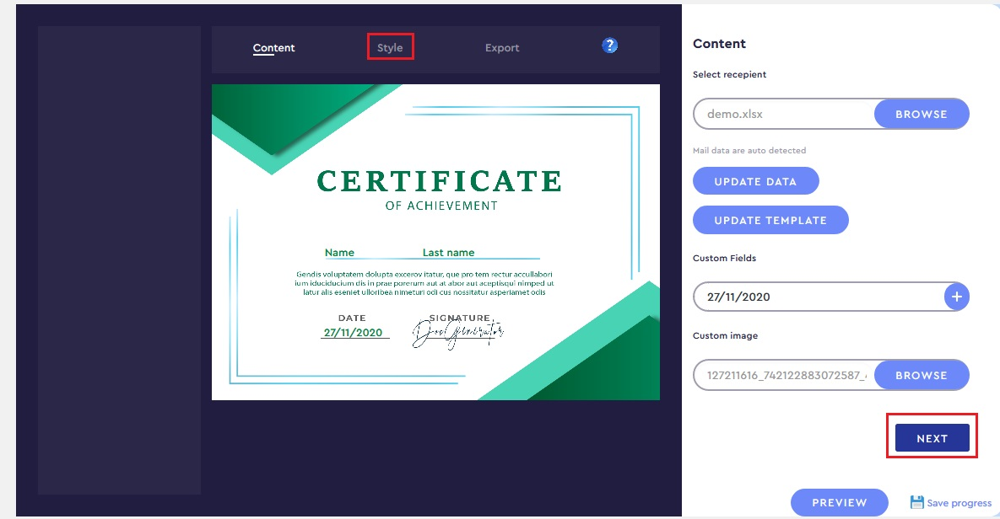

> Now you must to select desired fields or all fields by clicking on **select all fields** button, then you can change:
  1. Typography.
  2. Text Size and weight.
  3. Text color.

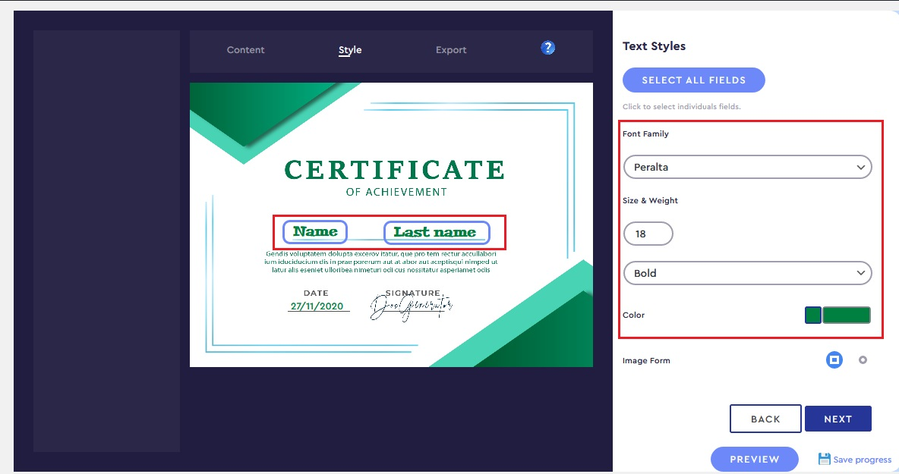

## Image Style

> After selecting desired image, you can change her forme : **Square or circle**.

## Preview document

> You can at any step preview a demo of your document by clicking on **Preview** button.

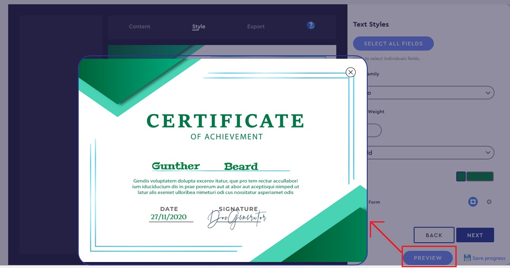

# **Export documents**

## Export documents

> You need to move to **Export pane**,the follow these steps:

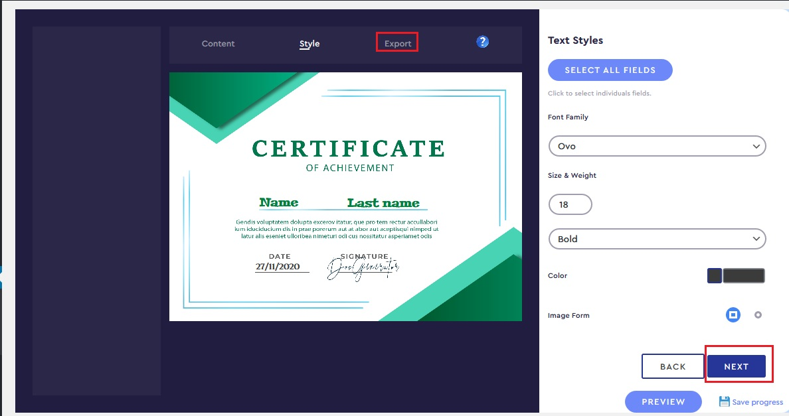

1. Type a file name. 
2. Select the type of files to export. 
  a. **PDF (All docs in one pdf)** : You will obtain one pdf that contain all documents generated. 
  b. **PDF (Each doc in on pdf)** : You will obtain one pdf document for each document. 
  c. **JPEG** : JPEG image format for each document. 
  d. **PNG** : PNG image forat for each document. 
3. You can choose your custom **size** for your documents, just type the **height** and **width**.
4. Select documents **resolution**
5. Click **Export** button.

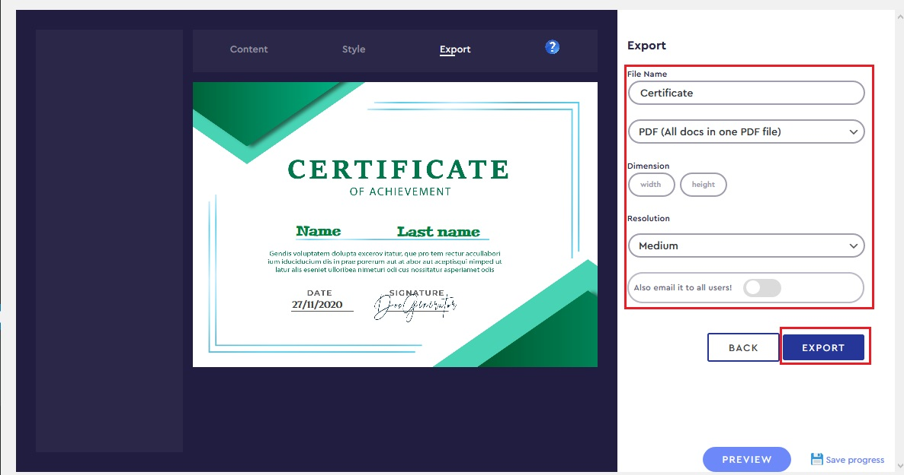

> Check your downloads page and you will find generated documents.

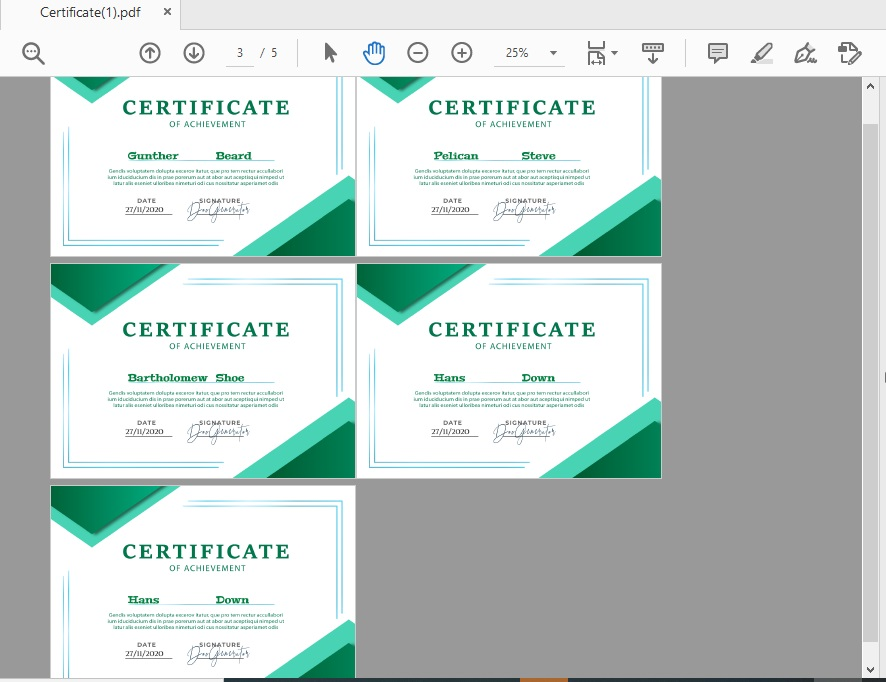

## Export and send mails

> **Mail adresses** data columns are auto detected so if you want to send document generated via e-mail to your customers, you need to follow these steps:

<<<<<<< HEAD
=======
- [How to Send Email in WordPress using the Gmail SMTP Server ](https://www.wpbeginner.com/plugins/how-to-send-email-in-wordpress-using-the-gmail-smtp-server/)
- [How to Configure WordPress to Use SMTP For Sending Emails](https://www.siteground.com/tutorials/wordpress/use-smtp/)

>>>>>>> 998627da253a224b541c5112b9127193239887b8
1. You must have an email addresses column in your main data.

2. Select JPEG or PNG file format.
3. Switch on **Also email it to all users!**.
4. If you have many columns that contains mail adresses, you can select the appropriate column name, and if it contain worng mail, they will be auto-detected.
5. Type mail Object.
6. Type mail message.
7. Click on export.

> If the selected column does not contain Wrong emails, then an e-mail will be sent to each adresse mail containing the document generated.

> If the selected column contains incorrect emails, a window will appear with the incorrect emails and you can cancel the export operation or ignore the wrong emails and continue the export and send operations.
<<<<<<< HEAD

# **Save document**

> You can at any time save your work by clicking on save document button at the right bottom of the page, then choose a file name.

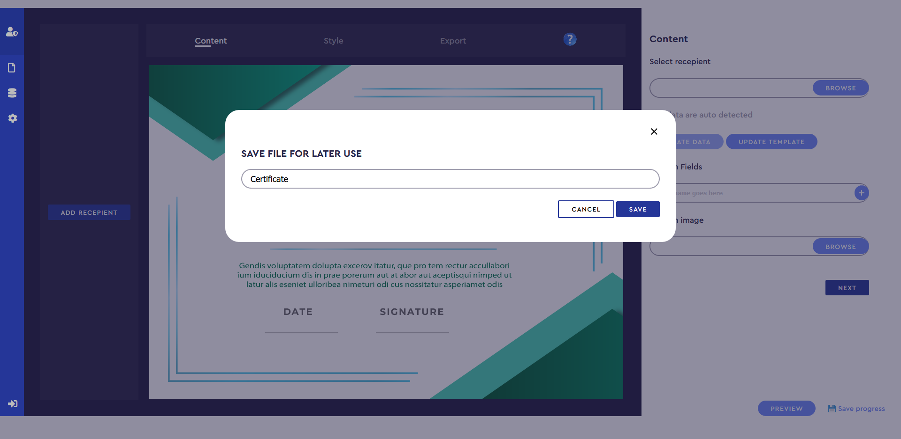

> The you can edit your documents from all documents menu.

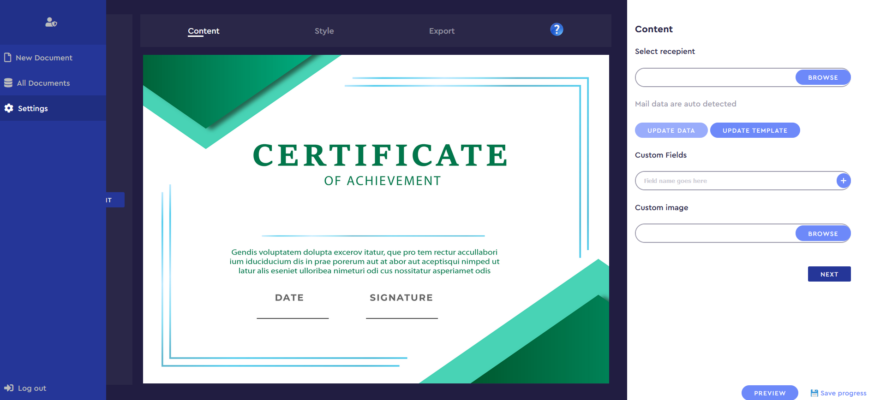

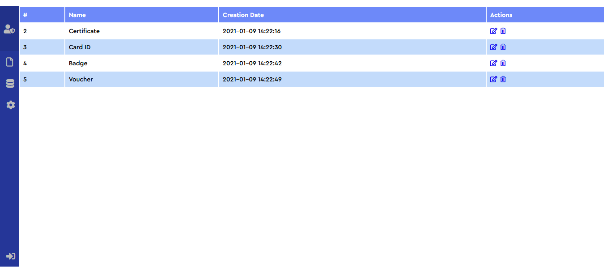

# **Update settings**

> You can at any time update theb main settings, just click on settings from the left menu.

>> **That's all, enjoy it !!**
===============
=======
>>>>>>> 998627da253a224b541c5112b9127193239887b8
